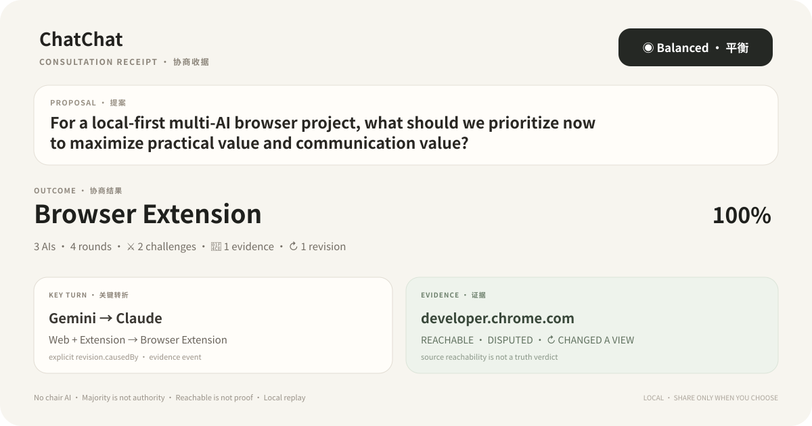

<div align="center">
  

  <p><strong>Bring the AI tabs you already use into one local consultation.</strong><br />Ask once. Let independent AIs think alone first, then challenge claims, bring evidence, revise positions, preserve disagreement, and decide what is still worth investigating.</p>

  <p><em>A small, polite intellectual riot — with receipts.</em></p>

  <p><a href="README.zh-CN.md">简体中文</a> · <a href="docs/BROWSER_EXTENSION.md">Browser Extension</a> · <a href="docs/CONSULTATION_PROTOCOL.md">Protocol</a> · <a href="https://github.com/Gaitxh/Chatchat-/issues">Ideas & Issues</a></p>
</div>

---

## Three monologues are not a meeting

Most multi-model interfaces stop here:

```text
You → ChatGPT
You → Claude
You → Gemini
```

ChatChat keeps going:

```text
one proposal
    ↓
sealed independent opinions
    ↓
shared Blackboard
    ↓
challenge · evidence · support · defense
    ↓
machine source observations
    ↓
revision · concede · surviving minority
    ↓
what is still unresolved?
    ↓
next move · local replay · shareable receipt
```

There is **no chair AI**, no privileged evidence feed, and no forced unanimity. The user proposes; every AI participates as an equal peer; ChatChat coordinates the public event protocol.

<p align="center"></p>

---

## 01 · Pick the kind of meeting

Not every question deserves the same discussion.

<table>
<tr><td><strong>◉ Balanced</strong><br/>A practical default: disagree, update, finish.</td><td><strong>🌿 Explore</strong><br/>Keep alternatives alive longer; resist premature convergence.</td><td><strong>⚖ Decide</strong><br/>Make trade-offs explicit and finish with a usable recommendation.</td></tr>
<tr><td><strong>🔎 Verify</strong><br/>Push on facts, source scope, dates, evidence gaps and uncertainty.</td><td><strong>🧨 Stress Test</strong><br/>Search for strongest counterexamples and failure conditions — without inventing disagreement for drama.</td><td><strong>Same mode, every AI</strong><br/>The mode changes the meeting goal and pacing, never participant authority.</td></tr>
</table>

The selected mode is visible above the proposal. It changes both the public pacing and the shared `MODE_GOAL_JSON` seen by every participant.

---

## 02 · Watch evidence move the room

A source entering the meeting does **not** end the argument.

```text
R1 · SEALED

ChatGPT  → Browser Extension
Claude   → Web + Extension
Gemini   → Browser Extension

        ↓

⚔ ChatGPT → Claude
  “What evidence justifies maintaining two product cores?”

📎 Gemini → Blackboard
  developer.chrome.com

        ↓

👁 SOURCE OBSERVATION

SOURCE STATE        REACHABLE
PAGE DATE           2026-07-14
CONTENT FINGERPRINT sha256:…
BOUNDED EXCERPT     “Optional permissions can be requested…”

⚠ Reachable ≠ claim proven.

        ↓

🔎 ChatGPT challenges the evidence scope
   “This supports the permission mechanism,
    not the stronger adoption claim.”

        ↓

↻ Claude revises

Web + Extension
      ↓
Browser Extension

causedBy: Gemini evidence event
```

The same evidence can be **reachable, disputed, and influential at the same time**. ChatChat keeps those facts separate.

`ROOM PULSE` shows explicit positions. `LIVE MOMENTS` surfaces event-backed turning points. `RELATIONSHIP MAP` draws only traceable edges. `CONSULTATION THEATER` lets you open the original event that caused a revision.

> Spectacle is allowed. Invented drama is not.

---

## 03 · The meeting can tell you what is still unresolved

An outcome is not the end of inquiry.

The **Evidence Gap Radar** looks only at structured events and asks things such as:

```text
⚔ challenged claim · no evidence linked
👁 source supplied · not observed yet
🕒 source date missing
🔎 evidence still disputed
↻ evidence changed a view
🧍 minority view survived the final round
```

From those gaps, **NEXT MOVE** offers transparent follow-ups:

```text
↻ Stress-test the evidence-driven revision

This evidence is disputed and also explicitly caused a later revision.
That makes it worth a focused re-check.

[ Use as next proposal ]   [ Trace why ]
```

Clicking a move only stages a new proposal and preselects a suggested meeting mode. **Nothing auto-sends.** You review it, change it, switch modes if you want, and decide whether another consultation happens.

That makes ChatChat a continuing investigation without inventing a chairperson.

---

## 04 · Take the meeting with you

A finished consultation can collapse into one local **Consultation Receipt** — enough context to share what happened without exporting the whole chat transcript.

<p align="center"></p>

The receipt is derived from structured events, final positions and frozen evidence observations. It can show:

- meeting mode and outcome;
- challenge / evidence / revision counts;
- an explicit evidence → revision key turn;
- reachable / disputed / changed-a-view evidence state;
- surviving minority positions.

**Copy Markdown** produces HTML-safe text. **Export SVG** creates the card locally in your browser. ChatChat uploads nothing on its own.

---

## Watch as much — or as little — as you want

The Full Room has three spectator modes that never change the underlying consultation:

```text
◌ Quiet   → proposal + outcome
◉ Live    → public positions + turning points
⚡ Arena   → relationship battlefield + stronger motion
```

Arena respects `prefers-reduced-motion`. “Room heat” means interaction intensity, **not answer quality**. 100% alignment still does not mean 100% truth.

---

## Local-first by design

For a normal user, setup should feel like:

```text
1 · Open the AI sites you already use
2 · Let ChatChat connect the discovered AIs
3 · Write one proposal
```

Underneath, ChatChat attempts page discovery → a short connection handshake → the structured Consultation Gate. If an AI is on a login page, sign in normally; after the page reloads, ChatChat resumes automatically. Manual selector teaching lives under **Advanced repair**.

Provider accounts remain in their own browser tabs. ChatChat has no relay server. Evidence source checks use bounded, credential-free fetches after browser permission. Archive replay reads frozen local IndexedDB events and evidence observations with **zero automatic Provider calls and zero automatic source re-checks**.

---

## Quick start

```bash
git clone https://github.com/Gaitxh/Chatchat-.git
cd Chatchat-
npm install
npm run build:extension
```

Open `chrome://extensions` or `edge://extensions`, enable **Developer mode**, choose **Load unpacked**, and select `dist-extension/`.

```bash
npm run check
npm test
npm run dev:web
```

See the [Browser Extension guide](docs/BROWSER_EXTENSION.md) and [Consultation Protocol](docs/CONSULTATION_PROTOCOL.md).

---

## Human-led, AI-assisted

ChatChat is created and independently maintained by **Gaitxh**, with product ideation, interface and visual design, implementation, debugging, testing, and documentation assistance from **OpenAI's ChatGPT and Codex**.

Every direction and final change remains human-directed and reviewed. ChatChat is an independent open-source project and is **not sponsored, endorsed, or operated by OpenAI**.

<div align="center"><strong>One proposal. Independent minds. Shared reasoning.</strong><br /><sub>Evidence can matter without becoming authority.</sub></div>
