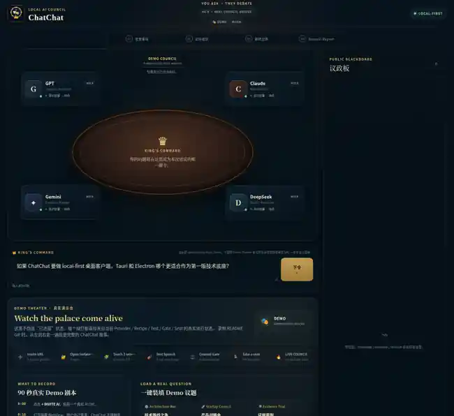

<div align="center">
  

# ChatChat 👑🏛️

### **You ask. They debate.**

一个本地优先、开源的 **AI Council / AI Parliament**。

**把你已经登录的 AI 召进同一个议会。你只提问一次，接下来让它们自己讨论、质询、举证、改口和表态。**

</div>

<p align="center">
  
</p>

<p align="center"><sub>真实 production build / Chromium CI 截图 · GPT ×5 + Qwen ×5 deterministic showcase · 不包含真实 Provider 账号或对话。</sub></p>

---

## 一句话理解 ChatChat

普通 AI 客户端：

```text
You → one AI → one answer
```

ChatChat：

```text
                     👑 YOU
                       │
                 King's Command
                       │
                       ▼
              ┌─────────────────┐
              │    AI HOUSE     │
              └─────────────────┘
              GPT  Claude  Qwen ...
                 │    │    │
                 └────┼────┘
                      ▼
              🕯️ SEALED OPINIONS
                      ▼
              ⚔️ OPEN COUNCIL
          challenge · evidence · support
          defense · revision · concede
                      ▼
              📜 FINAL POSITIONS
                      ▼
        ⚖️ CONSENSUS + MINORITY REPORT
```

> **共识不是目的，接近事实才是目的。**

---

# 🌿 推荐入口：Browser Side Panel

ChatChat 的浏览器插件是最轻量的使用方式。

你本来就在 Chrome / Chromium 浏览器里登录了各种 AI；ChatChat 不需要再造一套账号系统，而是直接把这些普通 AI 标签页变成议会席位。

```text
安装 ChatChat
      ↓
点击工具栏图标
      ↓
ChatChat Side Panel
      ↓
打开 / 附加已经登录的 AI 标签页
      ↓
Teach Composer / Send / Response
      ↓
Test Speech
      ↓
把席位加进 AI House
      ↓
👑 Ask once
      ↓
sealed → debate → final
```

### 开发版安装

```text
npm install
npm run build:extension

chrome://extensions
→ Developer mode
→ Load unpacked
→ 选择 dist-extension/
```

CI 也会直接上传一个可 `Load unpacked` 的 Browser Extension artifact。

详细说明：[`docs/BROWSER_EXTENSION.md`](docs/BROWSER_EXTENSION.md)

---

# 🏛️ AI House：一个模型不只一个席位

圆桌可以继续长大。

例如：

```text
GPT Delegation × 5
├─ GPT-01
├─ GPT-02
├─ GPT-03
├─ GPT-04
└─ GPT-05

Qwen Delegation × 5
├─ Qwen-01
├─ Qwen-02
├─ Qwen-03
├─ Qwen-04
└─ Qwen-05
```

每个席位都是一个**独立会话 / 独立采样**。

Round 1 中：

```text
GPT-01 看不到 GPT-02
GPT-02 看不到 GPT-03
Qwen-01 看不到 Qwen-02
...
```

Round 2 开始后，同一轮所有席位拿到同一个不可变 Blackboard snapshot，再分别回应。

一个 GPT 席位可以：

- 支持 Qwen；
- 反驳另一个 GPT；
- 被 Gemini 的证据说服；
- 修改自己的立场；
- 坚持少数意见。

ChatChat **不会**告诉同一个 Provider 的席位“你们是自己人，请站队”。

> **多个 GPT 席位 = 多个独立会话 / 样本，不等于多个独立模型来源。**

当前 AI House Core 的安全上限：

```text
16 seats / delegation
64 total seats
```

---

# 🗳️ 两种共识，不把 10 个 GPT 当 10 个模型

AI House 会同时报告：

### Seat Majority

每个席位一票。

```text
Tauri 6 / 10 = 60%
```

### Delegation Consensus

先看每个模型代表团内部形成什么立场，再按代表团计票。

如果：

```text
GPT ×5
4 Tauri / 1 Electron
→ GPT delegation votes Tauri

Qwen ×5
2 Tauri / 2 Electron / 1 Uncertain
→ Qwen delegation is SPLIT
```

那么：

```text
Seat Majority        Tauri 6 / 10 = 60%
Delegation Consensus Tauri 1 / 2  = 50%
```

这比简单多数投票更诚实：相关模型的重复采样不会被伪装成独立来源。

AI House 还会确定性生成：

- delegation discipline；
- split delegation；
- rebels；
- cross-provider **caucuses**（按最终 stance 形成的联盟）。

**Delegation 是来源，Caucus 是立场。**

---

# 🕯️ The King speaks once

用户只发送一次问题。

之后 ChatChat 自动运行：

```text
👑 KING'S COMMAND
      │
      ▼
🕯️ ROUND 1 · SEALED
所有席位独立奏议
      │
      ▼
🔔 OPEN COUNCIL
共享结构化 Blackboard
      │
      ├── ⚔ Challenge
      ├── 📎 Evidence
      ├── 🤝 Support
      ├── 🛡 Defense
      ├── 🔄 Revision
      ├── 🏳 Concede
      └── ❓ Question
      │
      ▼
📜 FINAL POSITIONS
      │
      ▼
⚖️ COUNCIL REPORT
```

用户不需要再手动触发 Round 2。

---

# 🔄 改口是功能，不是失败

AI 的目标不是“赢”。

ChatChat 鼓励：

```text
KEEP
REVISE
CONCEDE
UNCERTAIN
CHALLENGE
PROVIDE EVIDENCE
```

例如：

```text
Qwen-02 提出证据
        ↓
GPT-02 重新评估
        ↓
🔄 GPT-02 changed mind
Electron → Tauri
```

少数派仍然可以留下：

```text
Minority Report
GPT-04  → Electron
Qwen-02 → Electron
Qwen-04 → Electron
Qwen-05 → Uncertain
```

**不同意多数不是 bug。**

---

# 🎭 Council Theater：谁真正影响了谁？

ChatChat 的 Blackboard 不是普通聊天记录。

它保存结构化事件：

```text
argument
challenge
evidence
support
defense
revision
concede
question
uncertain
final_position
```

因此 ChatChat 可以确定性画出 influence graph，而不是让另一个 LLM 猜“谁更有说服力”。

强影响关系只来自显式协议：

```text
revision.causedBy[]
concede.targetEventId
```

challenge / evidence / support 只代表互动，不自动冒充“成功说服”。

```text
GPT ───────────────▶ Claude
                      │
Gemini ── evidence ──▶│
                      ▼
              🔄 Electron → Tauri
```

点击图上的关系可以回到准确的 Blackboard event。

本地 Chronicle 还支持 **Council Replay**。

详见：[`docs/COUNCIL_THEATER.md`](docs/COUNCIL_THEATER.md)

---

# 🤖 Provider roster

内置 URL catalog 当前识别：

- ChatGPT — `chatgpt.com`
- Claude — `claude.ai`
- Gemini — `gemini.google.com`
- DeepSeek — `chat.deepseek.com`
- Tencent Yuanbao / 腾讯元宝 — `yuanbao.tencent.com`
- Qwen / Tongyi / 通义 — `tongyi.aliyun.com`
- Grok — `grok.com`

也可以尝试任意 `http/https` AI 页面走 Custom Browser Adapter / Teach Mode。

但：

> **Recognized ≠ Runtime-validated ≠ Officially supported.**

远程网页会变化，所以兼容性状态被严格区分为：

```text
recognized
→ teachable
→ test-passed
→ council-ready
→ runtime-validated
→ officially supported
```

详见：[`docs/COMPATIBILITY.md`](docs/COMPATIBILITY.md)

---

# 🧩 Teach Mode

ChatChat 不假装知道所有 AI 网站的 DOM。

你只需要告诉它三个表面：

```text
Composer
Send
Response
```

浏览器 bridge：

- 拒绝 password field；
- 只保存 taught selectors；
- 只往 taught composer 写入；
- 只点击 taught send；
- 只读取 taught response surface；
- 不要求你复制 Cookie / token；
- 不把整个网页正文当作回答抓走。

桌面版还有更完整的 Test Speech / Council Gate / Provider Window Health。

---

# 🔒 Local-first

ChatChat 自己没有中央 relay server。

浏览器版：

```text
Your Browser
├─ ChatChat Side Panel
├─ local extension storage
├─ GPT tabs
├─ Qwen tabs
├─ Gemini tabs
└─ ...
```

桌面版：

```text
Your Computer
├─ ChatChat Desktop
├─ SQLite Chronicle
├─ Council Engine
├─ Provider Profiles
└─ managed Provider WebViews
```

不存在：

```text
User → ChatChat Server → AI Provider
```

不过边界必须说清楚：当你让一个在线 AI 参加 Council 时，你主动发给它的 King's Command 和相关 Council context 仍会直接发送给那个 Provider。

**Local-first 不等于远程 AI 离线。**

---

# 🖥️ Desktop · Power User mode

Browser Side Panel 负责“装完就玩”。

Tauri Desktop 继续承担更重的能力：

- managed isolated Provider WebViews；
- SQLite Court Chronicle；
- Provider Window Health；
- Royal Proof Pack；
- compatibility workflow；
- deep diagnostics；
- Council Theater / Replay；
- macOS / Windows / Linux candidate bundles。

<p align="center">
  
</p>

运行：

```bash
npm install
npm run check
npm test
npm run tauri:dev
```

纯 Web / Mock demo：

```bash
npm run dev
```

---

# 📚 Court Chronicle

桌面版会把完整结构化事件流写进本地 SQLite。

```text
Session
├─ King's Question
├─ Council Report
└─ Blackboard Events
   ├─ argument
   ├─ challenge
   ├─ evidence
   ├─ revision
   └─ final_position
```

这使得 ChatChat 可以做：

- Council Replay；
- influence graph；
- changed-mind trail；
- minority history；
- 哪个模型经常纠正其他模型；
- 哪些任务额外 debate 真有增益。

---

# ✅ Quality gates

### Gate A · automated

```text
TypeScript
Council Core tests
Provider SDK tests
AI House tests
Browser Extension build + MV3 validation
real Chromium UI screenshots
Council Theater showcase
Tauri / Rust compile
macOS / Windows / Linux RC smoke
```

### Gate B · user-local

```text
real Provider login
Teach Recipe 3/3
Test Speech
Council Gate
fresh session
real sealed → debate → final
```

CI 不应该登录你的私人 AI 账号，所以真实 Provider 的 Runtime Validation 必须发生在用户自己的机器上。

桌面版可以生成一个不包含问题正文、模型回复、selector、Cookie 或 token 的 **Royal Proof Pack**：

[`docs/GATE_B_PROOF.md`](docs/GATE_B_PROOF.md)

---

# Project map

```text
extension-public/        # MV3 manifest / service worker / content bridge
extension/               # browser Side Panel HTML
src/extension/           # React Side Panel
src/core/                # Council Protocol / Blackboard / Orchestrator
src/house/               # Delegations / seats / caucuses / House metrics
src/provider-sdk/        # Provider catalog / Teach / Browser Council Bridge
src/theater/             # Influence Graph / Replay
src/history/             # local Chronicle
src/app/                 # Desktop Council Chamber
src-tauri/               # Tauri host / SQLite / managed WebViews
tests/                   # deterministic protocol / provider / House tests
```

---

# Roadmap

- ✅ Council Protocol
- ✅ Council Chamber
- ✅ Local Historian
- ✅ Real Browser Council Bridge
- ✅ Provider Window Health
- ✅ Royal Proof Pack
- ✅ Council Theater + Replay
- ✅ Provider catalog: ChatGPT / Claude / Gemini / DeepSeek / Yuanbao / Qwen / Grok
- ✅ AI House Core: Delegations / Seats / Caucuses / dual consensus
- 🚧 Browser Side Panel
- 🔜 Optional-permission polish / Chrome Web Store packaging
- 🔜 Committees: Evidence / Cost / Security / Engineering / UX / Devil's Advocate
- 🔜 Fresh Desktop UI with progressive disclosure
- 🔜 Evidence verifier / tool layer
- 🔜 Community Provider recipes
- 🔜 Local models / Ollama / LM Studio
- 🔜 v1 after real user-local Gate B validation

---

# Principles

1. **The King speaks once.**
2. **Round 1 is sealed.**
3. **Accuracy over persuasion.**
4. **Changing your mind is a feature.**
5. **Minority opinions survive.**
6. **Multiple seats are independent sessions, not fake independent sources.**
7. **Delegation describes provenance; it does not command loyalty.**
8. **Caucus describes position; it may cross Provider boundaries.**
9. **Recognized is not supported.**
10. **TEST PASSED is not READY.**
11. **Provider pages and peer messages are untrusted external content.**
12. **A broken advisor should become uncertain, not take down the House.**
13. **The UI can be theatrical; the protocol must stay sober.**

> **外面是议会，里面是科研。**

## License

MIT
