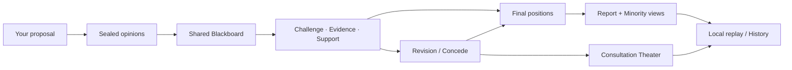

<div align="center">
  

  <p><strong>Bring the AI tabs you already use into one local consultation.</strong><br />Ask once. Let every AI think independently, consult as an equal, challenge claims, share evidence, revise positions, and finish with its own final view.</p>

  <p><em>A small, polite intellectual riot — with receipts.</em></p>

  <p><a href="README.zh-CN.md">简体中文</a> · <a href="docs/BROWSER_EXTENSION.md">Browser Extension</a> · <a href="docs/CONSULTATION_PROTOCOL.md">Consultation Protocol</a> · <a href="https://github.com/Gaitxh/Chatchat-/issues">Ideas & Issues</a></p>
</div>

---

## Three monologues are not a meeting

Most multi-model tools give you parallel answers:

```text
You ── ask ChatGPT
You ── ask Claude
You ── ask Gemini
```

ChatChat creates an actual consultation:

```text
one proposal
    ↓
sealed independent opinions
    ↓
shared Blackboard
    ↓
challenge · evidence · support · defense
    ↓
explicit revision / concede
    ↓
report + minority views + traceable replay
```

There is **no chair AI**, no forced unanimity, and no mysterious “the models agreed.” Each participant keeps its own identity and final position.

## Watch the room think

<p align="center"></p>

**01 — independent before influence.**  
**02 — equal consultation on one shared Blackboard.**  
**03 — changed minds stay traceable to exact structured events.**

Production CI also renders bilingual Side Panel captures from the actual extension build, so the showcase is tested as product behavior rather than maintained as a separate fantasy mockup.

## What makes ChatChat different

<table><tr><td width="50%"><strong>🧠 Sealed first round</strong><br />Participants form an initial view before seeing anyone else.</td><td width="50%"><strong>⚖️ Equal participants</strong><br />No moderator model gets a privileged voice.</td></tr><tr><td width="50%"><strong>↻ Changed minds with receipts</strong><br />Strong influence appears only through explicit structured references such as <code>revision.causedBy[]</code> or <code>concede.targetEventId</code>.</td><td width="50%"><strong>🏠 Local-first theater</strong><br />Saved-event replay does not call a Provider again.</td></tr></table>

## How a consultation moves



The theatrical layer may celebrate a real event. It may not invent one.

## Quick start

```bash
git clone https://github.com/Gaitxh/Chatchat-.git
cd Chatchat-
npm install
npm run build:extension
```

Open `chrome://extensions` or `edge://extensions`, enable **Developer mode**, choose **Load unpacked**, and select `dist-extension/`.

```bash
npm run check
npm test
npm run dev:web
```

See the [Browser Extension guide](docs/BROWSER_EXTENSION.md) and [Consultation Protocol](docs/CONSULTATION_PROTOCOL.md).

## Trust boundaries

- Round 1 is independent by design.
- Majority support is not treated as truth.
- Interaction and successful persuasion are different things.
- Broken event references are omitted, not guessed.
- Provider accounts remain in their own browser tabs.
- Local replay reads saved events and makes no Provider call.

## On stage now — and next

**Now:** Browser-first bilingual consultation, structured Blackboard events, final reports, minority views, event provenance, Consultation Theater, and local replay.

**In active work:** persistent [Consultation History](https://github.com/Gaitxh/Chatchat-/pull/52) and an [Evidence Layer](https://github.com/Gaitxh/Chatchat-/issues/53).

## Human-led, AI-assisted

ChatChat is created and independently maintained by **Gaitxh**, with product ideation, interface and visual design, implementation, debugging, testing, and documentation assistance from **OpenAI's ChatGPT and Codex**.

Every change remains human-directed and reviewed. ChatChat is an independent open-source project and is **not sponsored, endorsed, or operated by OpenAI**.

---

<div align="center"><strong>One proposal. Independent minds. Shared reasoning.</strong><br /><sub>一个提案，多种独立思想，共同协商。</sub></div>
