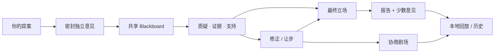

<div align="center">
  

  <p><strong>把浏览器里已经在使用的 AI 标签页，带进同一场本地协商。</strong><br />
  你只提问一次。每个 AI 先独立思考，再以平等身份质疑观点、补充证据、修正立场，并保留自己的最终意见。</p>

  <p><em>一场礼貌、热闹、带证据、还能回放的思想碰撞。</em></p>

  <p>
    <a href="README.md">English</a>
    · <a href="docs/BROWSER_EXTENSION.zh-CN.md">浏览器扩展</a>
    · <a href="docs/CONSULTATION_PROTOCOL.zh-CN.md">协商协议</a>
    · <a href="https://github.com/Gaitxh/Chatchat-/issues">想法与问题</a>
  </p>

  <p>
    
    
    
    
  </p>
</div>

---

## 三个独白，不叫协商

大多数多模型工具只是把答案并排放好：

```text
你 ── 问 ChatGPT
你 ── 问 Claude
你 ── 问 Gemini
```

ChatChat 更像一间小小的 AI 会议室：

```text
用户提交一个提案
        ↓
各自密封、独立思考
        ↓
进入共享 Blackboard
        ↓
质疑 · 证据 · 支持 · 辩护
        ↓
明确修正 / 让步
        ↓
协商报告 + 少数意见 + 可追溯回放
```

这里**没有议长 AI**，不强迫大一统，也不会用一句神秘的“模型们一致认为”抹掉分歧。每个参与者都保留自己的身份和最终立场。

## 看见 AI 是怎么想的

<p align="center">
  
</p>

这段演示来自真实产品截图：独立席位、共享协商空间、最终结果、`Web + Extension → Browser Extension` 的明确改口、协商剧场，以及本地历史回放预览。

<details>
  <summary><strong>展开完整中文产品截图</strong></summary>
  <p align="center"></p>
</details>

<details>
  <summary><strong>展开完整英文产品截图</strong></summary>
  <p align="center"></p>
</details>

## ChatChat 有什么不一样

<table>
  <tr>
    <td width="50%"><strong>🧠 先独立，再交流</strong><br />第一轮互相不可见。先记录自然分歧，再让影响真正发生。</td>
    <td width="50%"><strong>⚖️ 所有 AI 平等入席</strong><br />没有一个模型天然拥有主持权。ChatGPT、Claude、Gemini 以及其他参与者都遵循同一套协议。</td>
  </tr>
  <tr>
    <td width="50%"><strong>↻ 改口必须有票据</strong><br />ChatChat 不靠文字相似度猜“谁说服了谁”。只有 <code>revision.causedBy[]</code>、<code>concede.targetEventId</code> 等明确结构化关系，才会显示为强影响。</td>
    <td width="50%"><strong>🏠 本地优先，可回放</strong><br />浏览器扩展协调你电脑上已经打开的 AI 标签页。读取已保存事件进行回放时，不会再次调用 Provider。</td>
  </tr>
</table>

## 一场协商如何推进



剧场可以庆祝真实发生的事件，但不能编造戏剧性。

## 快速开始

```bash
git clone https://github.com/Gaitxh/Chatchat-.git
cd Chatchat-
npm install
npm run build:extension
```

随后打开 `chrome://extensions` 或 `edge://extensions`，启用**开发者模式**，选择**加载已解压的扩展程序**，并加载 `dist-extension/`。

开发与验证：

```bash
npm run check
npm test
npm run dev:web
```

Provider 配置请查看[浏览器扩展指南](docs/BROWSER_EXTENSION.zh-CN.md)，结构化事件含义请查看[协商协议](docs/CONSULTATION_PROTOCOL.zh-CN.md)。

## 信任边界

- 第一轮默认独立，不看其他参与者答案。
- 多数支持不等于事实成立。
- “发生互动”和“成功说服”是两件事。
- 找不到的事件引用会被省略，不会被猜出来。
- AI 账号仍留在各自的浏览器标签页中。
- 本地回放只读取保存事件，不重新请求 AI Provider。

## 已经登台，以及下一幕

**目前已有：** 浏览器优先的中英双语协商、结构化 Blackboard、最终报告、少数意见、事件溯源、协商剧场与本地回放。

**正在推进：** 持久化的[协商记录](https://github.com/Gaitxh/Chatchat-/pull/52)，以及把“给了一个来源”和“这个主张真的被验证”明确分开的[证据层](https://github.com/Gaitxh/Chatchat-/issues/53)。

## 人类主导，AI 协作完成

ChatChat 由 **Gaitxh** 发起并独立维护；**OpenAI 的 [ChatGPT](https://chatgpt.com/) 与 [Codex](https://openai.com/codex/)** 协助完成产品构思、界面与视觉设计、代码实现、调试、测试和文档打磨。

所有变更仍由人类提出方向、审阅并决定是否采用。本项目是独立开源项目，**不代表 OpenAI 官方，也未获得 OpenAI 的赞助、背书或运营支持**。

---

<div align="center">
  <strong>一个提案，多种独立思想，共同协商。</strong><br />
  <sub>One proposal. Independent minds. Shared reasoning.</sub>
</div>
