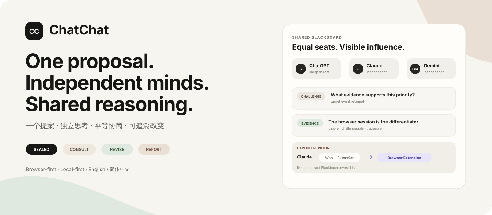
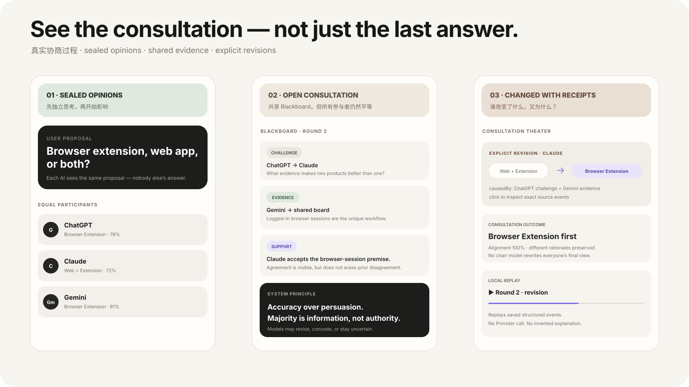

<div align="center">
  

  <p><strong>把浏览器里已经在使用的 AI 标签页，带进同一场本地协商。</strong><br />你只提问一次。每个 AI 先独立思考，再平等质疑、拿出证据、修正立场，并保留自己的最终意见。</p>

  <p><em>一场礼貌、热闹、带票据、还能回放的思想碰撞。</em></p>

  <p><a href="README.md">English</a> · <a href="docs/BROWSER_EXTENSION.zh-CN.md">浏览器扩展</a> · <a href="docs/CONSULTATION_PROTOCOL.zh-CN.md">协商协议</a> · <a href="https://github.com/Gaitxh/Chatchat-/issues">想法与问题</a></p>
</div>

---

## 三个独白，不叫协商

```text
普通多模型界面                    ChatChat

你 → ChatGPT                      一个提案
你 → Claude                           ↓
你 → Gemini                       密封独立意见
                                     ↓
                                共享 Blackboard
                                     ↓
                             质疑 · 证据 · 支持
                                     ↓
                              机器来源观察
                                     ↓
                                修正 · 让步
                                     ↓
                       结果 · 少数意见 · 可追溯回放
```

这里**没有议长 AI**，不强迫所有模型最后说同一句话，也不会神秘地告诉你“AI 们达成了共识”。每个 AI 都是平等参与者。用户只负责发起提案，ChatChat 负责协调会议。

## 看见这场会议动起来

<p align="center"></p>

Side Panel 不是一堵不断往下滚的回答墙，而是一场可以观赛的公开协商：

**ROOM PULSE / 会议脉搏** 看当前明确立场和对齐度。  
**LIVE MOMENTS / 关键时刻** 看真实发生的交锋、证据、让步与改口。  
**RELATIONSHIP MAP / 关系战场** 只画有事件 ID 支撑的关系，普通文字提及不会凭空制造“谁说服了谁”。  
**CONSULTATION THEATER / 协商剧场** 在会后逐事件回放整场会议。

> 可以有戏，但不能编剧情。

## 一条证据走进会议室。会议室不会向它下跪。

ChatChat 想让你看见的，是这样的协商：

```text
R1 · 密封独立意见

ChatGPT  → Browser Extension
Claude   → Web + Extension
Gemini   → Browser Extension

        ↓

R2 · 公开协商

⚔ ChatGPT → Claude
  “同时维护两个产品核心，有什么证据值得这个成本？”

📎 Gemini → Blackboard
  Chrome 扩展权限文档
  developer.chrome.com

        ↓

👁 CHATCHAT 来源观察

来源状态          来源可达
页面日期          2026-07-14
内容指纹          sha256:…
有限摘录          “Optional permissions can be requested…”

⚠ 来源可达 ≠ 主张已被证明

        ↓

🔎 ChatGPT 继续质疑证据的适用范围
   “它能支持权限机制，
    但不能单独证明 extension-first 一定更利于增长。”

        ↓

↻ Claude 明确改口

Web + Extension
      ↓
Browser Extension

causedBy: Gemini 的 evidence event
```

同一条证据完全可以同时处于：**来源可达、仍有争议、并且确实促成了某个 AI 改口**。这是三件不同的事实，所以 ChatChat 不把它们揉成一个绿色“已验证 ✓”。

机器观察会通过独立的 `TOOL_FACTS_JSON` 进入后续轮次。同一轮里的所有 AI 会收到**完全相同的一份有限工具快照**。工具结果只是数据，不是新的“裁判 AI”，更不是事实盖章机。

## 对普通用户尽量零配置，底层仍然严格

电脑小白真正需要看到的应该只有：

```text
1 · 打开你平时就在用的 AI
2 · 自动连接我发现的 AI
3 · 写下一个提案
```

ChatChat 在下面自己做：

```text
找输入框 → 找发送动作 → 找 AI 回复区域
      ↓
短握手
      ↓
结构化协商协议验证
      ↓
READY ✓
```

如果某个 AI 还停在登录页，你只需要正常登录。标签页加载完成后，ChatChat 会自己继续连接。手动 selector / Teach Mode 全部退到 **高级修复**，只在网站大改版、自动识别真的失败时出现。

## 有票据，不靠气氛

<table>
<tr><td width="50%"><strong>🧠 第一轮真正密封</strong><br/>先记录自然分歧，再让彼此影响发生。</td><td width="50%"><strong>⚖️ 所有 AI 平等入席</strong><br/>没有模型天然拥有主持权，也没有谁能拿到私有工具事实。</td></tr>
<tr><td><strong>📎 证据账本</strong><br/>谁提交来源、谁质疑它、它是否明确触发修正，始终是不同事实。</td><td><strong>👁 来源观察</strong><br/>有限读取页面标题、日期、摘录、指纹，只描述页面实际暴露了什么，不裁决主张真伪。</td></tr>
<tr><td><strong>↻ 改口必须有票据</strong><br/>强影响必须来自 <code>revision.causedBy[]</code> 等明确 provenance。</td><td><strong>📚 冻结的本地史册</strong><br/>会议事件与当时的来源观察一起保存在 IndexedDB，历史回放默认零网络。</td></tr>
</table>

## 你可以决定“看多少”

Full Room 有三种观赛模式，它们**只改变 UI，不改变底层模型 Prompt**：

```text
◌ 安静   → 只看提案 + 结果
◉ 直播   → 看公开立场 + 关键转折
⚡ 竞技场 → 关系战场 + 更强动效
```

竞技场尊重 `prefers-reduced-motion`。**会议热度只是互动强度，不是答案质量；100% 对齐也不等于 100% 正确。**

## 快速开始

```bash
git clone https://github.com/Gaitxh/Chatchat-.git
cd Chatchat-
npm install
npm run build:extension
```

随后打开 `chrome://extensions` 或 `edge://extensions`，启用**开发者模式**，选择**加载已解压的扩展程序**，并加载 `dist-extension/`。

```bash
npm run check
npm test
npm run dev:web
```

## 信任边界

- AI 账号仍然留在各自浏览器标签页中。
- ChatChat 没有中转服务器。
- 第一轮默认独立。
- 多数支持不等于事实成立。
- 来源可达不等于主张已经被验证。
- 新证据域名需要用户明确授予浏览器权限；已经获得权限的来源可以在轮次之间进行有限观察。
- 工具观察使用有限、无凭证的读取，并在同一轮平等共享给所有 AI。
- 找不到的事件引用不会被系统猜出来。
- 历史回放不会重新调用 AI，也不会自动重新检查来源、用“今天的页面”改写过去。

## 已经登台

**浏览器优先的中英双语协商 · AI 页面自动连接 · 登录后自动续接 · 会议脉搏 · Live Moments · AI 关系战场 · 证据账本 · 来源观察 · 平等共享 Tool Facts · 协商剧场 · 本地协商历史 · 冻结证据回放。**

现在最重要的现实验收仍然是 [真实双 Provider 浏览器验收](https://github.com/Gaitxh/Chatchat-/issues/12)：在用户自己的电脑上，让两个真正已经登录的 AI 网站完成一场只由真实 Provider 参加的完整协商。

## 人类主导，AI 协作

ChatChat 由 **Gaitxh** 发起并独立维护；项目开发过程中使用了 **OpenAI 的 ChatGPT 与 Codex** 协助产品构思、界面与视觉设计、代码实现、调试、测试和文档打磨。

所有方向和最终变更仍由人类主导、审阅和决定。ChatChat 是独立开源项目，**不代表 OpenAI 官方，也未获得 OpenAI 的赞助、背书或运营支持**。

---

<div align="center"><strong>一个提案，多种独立思想，共同协商。</strong><br /><sub>证据可以产生影响，但不能自动变成权威。</sub></div>
