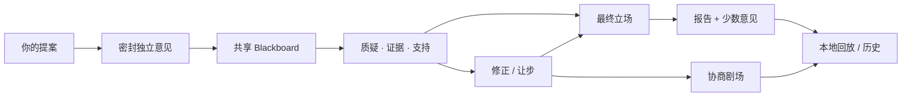

<div align="center">
  

  <p><strong>把浏览器里已经在使用的 AI 标签页，带进同一场本地协商。</strong><br />你只提问一次。每个 AI 先独立思考，再以平等身份质疑观点、补充证据、修正立场，并保留自己的最终意见。</p>

  <p><em>一场礼貌、热闹、带证据、还能回放的思想碰撞。</em></p>

  <p><a href="README.md">English</a> · <a href="docs/BROWSER_EXTENSION.zh-CN.md">浏览器扩展</a> · <a href="docs/CONSULTATION_PROTOCOL.zh-CN.md">协商协议</a> · <a href="https://github.com/Gaitxh/Chatchat-/issues">想法与问题</a></p>
</div>

---

## 三个独白，不叫协商

普通的多模型工具通常只是：

```text
你 ── 问 ChatGPT
你 ── 问 Claude
你 ── 问 Gemini
```

ChatChat 把它们带进一间真正的 AI 协商会议室：

```text
一个提案
   ↓
密封独立意见
   ↓
共享 Blackboard
   ↓
质疑 · 证据 · 支持 · 答辩
   ↓
明确修正 / 让步
   ↓
最终报告 + 少数意见 + 可追溯回放
```

这里**没有议长 AI**，不强迫所有模型最后说同一句话。每个参与者都保留自己的身份和最终立场。

## 看见 AI 是怎么想的

<p align="center"></p>

**01 — 先独立，再开始影响。**  
**02 — 所有 AI 在同一块 Blackboard 上平等协商。**  
**03 — 谁改口了、为什么改口，都能追溯到明确事件。**

Production CI 会从真实扩展构建中生成中英双语 Side Panel 截图，所以视觉展示和产品行为一起接受验证，不维护另一套“概念稿”。

## 为什么它有意思

<table><tr><td width="50%"><strong>🧠 第一轮真正密封</strong><br/>先记录自然分歧，再让影响发生。</td><td width="50%"><strong>⚖️ 所有 AI 平等入席</strong><br/>没有模型天然拥有主持权。</td></tr><tr><td width="50%"><strong>↻ 改口必须有票据</strong><br/>强影响只来自明确结构化关系，不靠文字相似度猜“谁说服了谁”。</td><td width="50%"><strong>🏠 本地优先，可回放</strong><br/>浏览器扩展协调本机 AI 标签页；回放保存事件时不再次调用 Provider。</td></tr></table>

## 一场协商如何推进



剧场可以庆祝真实发生的事件，但不能编造戏剧性。

## 快速开始

```bash
git clone https://github.com/Gaitxh/Chatchat-.git
cd Chatchat-
npm install
npm run build:extension
```

随后打开 `chrome://extensions` 或 `edge://extensions`，启用**开发者模式**，选择**加载已解压的扩展程序**，并加载 `dist-extension/`。

```bash
npm run check
npm test
npm run dev:web
```

## 信任边界

- 第一轮默认独立。
- 多数支持不等于事实成立。
- “发生互动”和“成功说服”是两件事。
- 找不到的事件引用不会被系统猜出来。
- AI 账号仍留在各自浏览器标签页中。
- 本地回放不重新请求 AI Provider。

## 已经登台，以及下一幕

**目前已有：** 浏览器优先的中英双语协商、结构化 Blackboard、最终报告、少数意见、事件溯源、协商剧场与本地回放。

**正在推进：** [协商记录](https://github.com/Gaitxh/Chatchat-/issues/57)、[证据层](https://github.com/Gaitxh/Chatchat-/issues/53)、[第一次协商引导](https://github.com/Gaitxh/Chatchat-/issues/58)，以及[真实双 Provider 浏览器验收](https://github.com/Gaitxh/Chatchat-/issues/12)。

## 人类主导，AI 协作

ChatChat 由 **Gaitxh** 发起并独立维护；项目开发过程中使用了 **OpenAI 的 ChatGPT 与 Codex** 协助产品构思、界面与视觉设计、代码实现、调试、测试和文档打磨。所有方向与最终变更仍由人类审阅和决定。

---

<div align="center"><strong>一个提案，多种独立思想，共同协商。</strong><br /><sub>One proposal. Independent minds. Shared reasoning.</sub></div>
